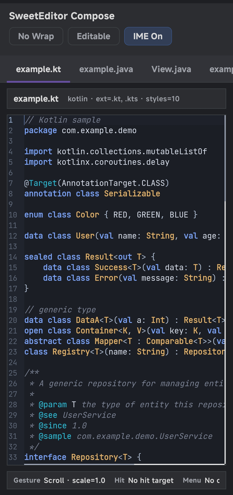

**English** | [简体中文](README_zh.md)

# SweetEditor

### A Multifunctional code editor library for compose multiplatform

**A C++17 core with platform-native rendering, built for long-term evolving editor infrastructure in IDEs, AI programming tools, cloud development workspaces, and similar products.**

---

>This repository is still in the development stage, so please pay attention.

## Platform Demo Screenshots

  <table>
    <tr>
      <td align="center"><b>Android</b> </td>
      <td align="center"><b>IOS screenshot</b> </td>
    </tr>
    <tr>
      <td align="center"><b>Desktop screenshot</b> </td>
      <td align="center"><b>Web screenshot</b> </td>
    </tr>
  </table>

## License

SweetEditor is licensed under the [GNU Lesser General Public License v2.1 or later](LICENSE) (LGPL-2.1+), with an additional [Static Linking Exception](EXCEPTION) provided as a supplementary clarification.

## Star History

<a href="https://www.star-history.com/?repos=lumkit%2FSweetEditor-Compose&type=timeline&legend=top-left">
 <picture>
   <source media="(prefers-color-scheme: dark)" srcset="https://api.star-history.com/image?repos=lumkit/SweetEditor-Compose&type=timeline&theme=dark&legend=top-left" />
   <source media="(prefers-color-scheme: light)" srcset="https://api.star-history.com/image?repos=lumkit/SweetEditor-Compose&type=timeline&legend=top-left" />
   
 </picture>
</a>
