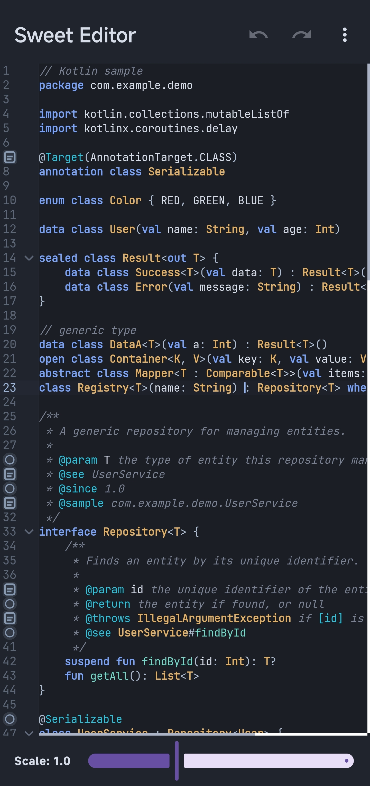
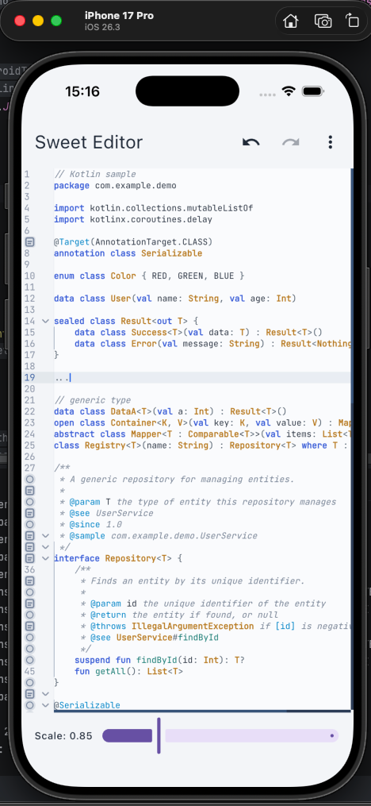
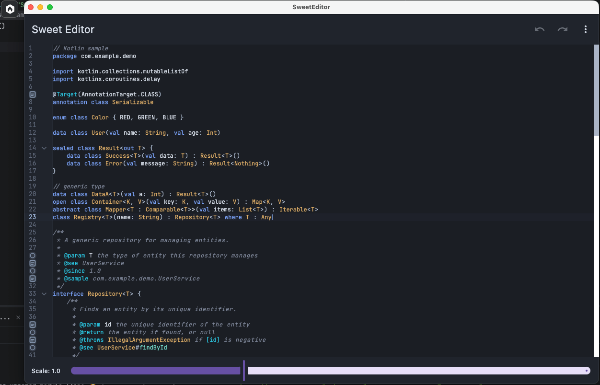

# SweetEditor Docs

SweetEditor is a Compose Multiplatform code editor library backed by a native C++17 core.

This documentation site is published from the repository `docs/` directory and is intended to provide an online entry point for setup, capabilities, and project references.

## Quick Links

- [Repository README](https://github.com/lumkit/SweetEditor-Compose/blob/main/README.md)
- [中文文档](README_zh.md)
- [Core Library: OpenSweetEditor](https://github.com/FinalScave/OpenSweetEditor)
- [License](https://github.com/lumkit/SweetEditor-Compose/blob/main/LICENSE)
- [Static Linking Exception](https://github.com/lumkit/SweetEditor-Compose/blob/main/EXCEPTION)

## Overview

- Compose Multiplatform wrapper for a native editor core
- Cross-platform targets: Android, iOS, JVM Desktop, JS, Wasm
- Render-model driven editor pipeline
- Decorations: diagnostics, inlay hints, phantom text, gutter icons
- Editing, completion, IME composition, folding, and rich cursor/selection support

## Screenshots

  <table>
    <tr>
      <td align="center"><b>Android</b> </td>
      <td align="center"><b>iOS</b> </td>
    </tr>
    <tr>
      <td align="center"><b>Desktop</b> </td>
      <td align="center"><b>Web</b> </td>
    </tr>
  </table>

